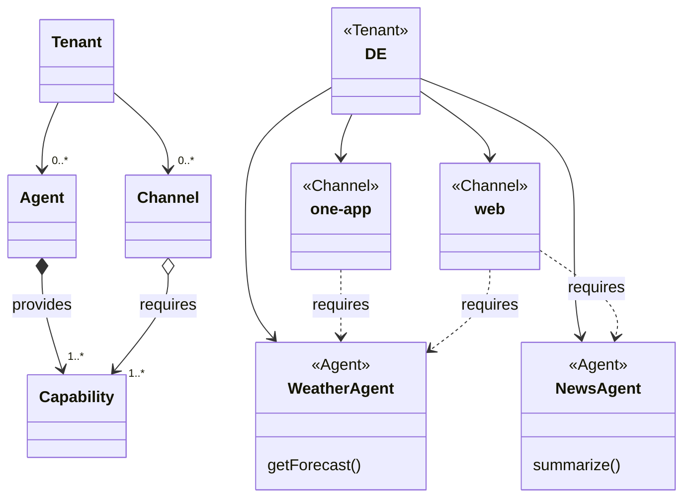
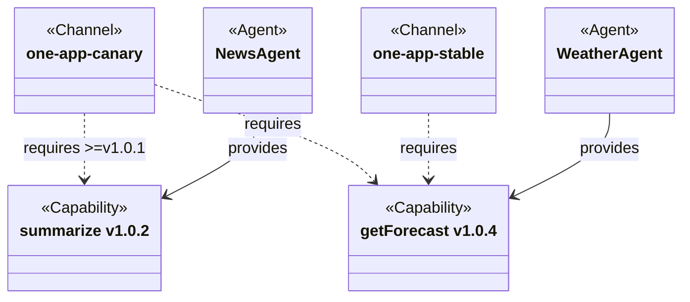

---
# You can also start simply with 'default'
theme: seriph
# random image from a curated Unsplash collection by Anthony
# like them? see https://unsplash.com/collections/94734566/slidev
background: /images/intro.png
# some information about your slides (markdown enabled)
title: The evolution of LMOS
info: |
  The evolution of LMOS
# apply unocss classes to the current slide
class: text-center
# https://sli.dev/features/drawing
drawings:
  persist: false
# slide transition: https://sli.dev/guide/animations.html#slide-transitions
transition: slide-left
# enable MDC Syntax: https://sli.dev/features/mdc
mdc: true
fonts:
  # like font-family in css, you can use `,` to separate multiple fonts for fallback
  sans: 'Helvetica Neue,Robot'
addons:
  - slidev-addon-asciinema
---

---
layout: image-right
image: /images/frag_magenta.png
backgroundSize: contain
---

# Frag Magenta

- Digital assistant of DT Customer Service
- Available for Web, OneApp, WhatsApp, Apple Business Chat and IVR in Germany
  
<br>

<SlidevVideo autoplay width="180">
  <!-- Anything that can go in an HTML video element. -->
  <source src="/videos/frag_magenta.mp4" type="video/mp4" />
  <p>
    Your browser does not support videos. You may download it
    <a href="/myMovie.mp4">here</a>.
  </p>
</SlidevVideo>

---
layout: image-right
image: /images/rasa_story.png
backgroundSize: contain
---

# Facing limitations

#### RASA’s Design:
- **Scripted Dialogue Flow:** Predefined YAML scripts guide dialogues.
- **Predictive Planning Required:** Customer interactions must be anticipated.
- **NLU Challenges:** NLU struggled with accurate intent recognition.
- **Manual Effort:** Continuous effort needed to update intents and train NLU.
- **Knowledge gap:** No FAQ knowledge base available.
- **Scripting:** YAML isn't a programming language.

---

# Overcoming limitations

#### Key Pain Points:
- **High Maintenance Costs:** Updating scripted dialogues is time-consuming and labor-intensive.
- **Customer Frustration:** Unresolved inquiries due to lack of knowledge led to negative customer experiences.
- **Call Center Costs:** Increased volume of customer queries at the call center, driving up costs.

<br>

#### Need for Change:
- **Improve NLU/NLP:** The existing NLU/NLP, static scripts and knowledge sources were not sufficient for many customer queries.
- **Objectives:** <span v-mark.red="1">Increase solution rate</span>, reduce call center volumes, lower maintenance costs and enhance customer satisfaction 

---

# Taking a bold decision

#### Advancements in Generative AI:
- **Large Language Models (LLMs):** Models showed potential for better language understanding and processing.
- **Opportunity:** Use LLMs and Retrieval Augmented Generation (RAG) to improve NLU/NLP and reasoning/planning.

<br>

#### Decision to Innovate:
- **Multi-tenant and omni-channel system:** A strategic move to develop a single system for multiple NatCos and channels by making use of M-APIs.
- **Multi-agent system (MAS):** Multiple LLM-based agents, each focused on a specific business domain, working together to solve customer inquiries.
- **Highly configurable:** Every tenant can have a unique set of Channels, Agents, capabilities and knowledge sources.
- **Objective:** Improve <span v-mark.circle.red="1">speed</span> to rollout the digital assistant to multiple NatCos: Austria and Croatia.


---
layout: image
image: /images/context_diagram.png
backgroundSize: contain
---


---

# Facing new territory and doubts

#### Industry Landscape:
- **Focus on Single-Agent Systems:** Most companies/frameworks were focused on single-agent RAG solutions.
- **Lack of Frameworks:** No established, production-ready multi-agent frameworks were available.

<br>

#### Team Concerns:
- **Distributed Team:** Coordination and sync between teams distributed across the globe.
- **Expertise Gap:** Dev team’s background in Java/Kotlin rather than AI-specific technologies/languages.

<br>

#### Internal Doubts:
- **Feasibility Concerns:** Doubts about the team’s ability to deliver a solution in time.
- **Building vs. Adapting:** Debate over whether to create a new solution or adapt/buy existing solutions.

---
layout: statement
---

# October 2023 - Birth of LMOS

A cloud-native **L**anguage **M**odel **O**perating **S**ystem for building, running and composing LLM-based AI Agents <br> <br>
Multi-tenant, Omni-Channel, Multi-agent

---
layout: image-right
image: /images/os_design.png
backgroundSize: contain
---

# Finding Inspiration (1/3)

#### Operating System Design:
- **OS/Kernel Analogy:** LMOS acts as a Kernel/OS between Agents and Infrastructure providing an abstraction layer.
- **Application Developemt:** An OS provides system calls --> LMOS provides an API to simplify agent development.
- **Abstractions:** An OS abstracts hardware --> LMOS abstracts the complexities of working with LLMs, memory and tools.
- **Application Management:** An OS manages applications --> LMOS manages Agents and is doing execution planning. 

---
layout: image-right
image: /images/smart_home.png
backgroundSize: contain
---

# Finding Inspiration (2/3)

#### Web of Things -> Web of Agents:
- **Standardized Communication (Access):** Built on top of open web standards and data models.
- **Discoverability and extendability (Find):** Dynamic discoverability of self-describing agents, allowing the multi-agent system to evolve.
- **Reusability (Share):** A single agent can be reused by multiple tenants concurrently.
- **Cross-Platform Compatibility (Compose):** Freedom to compose agents without being locked into a single platform.


---
layout: image-right
image: /images/spacex.png
backgroundSize: contain
---

# Finding Inspiration (3/3)

#### SpaceX Engineering Model:
- **Frequent Deployments:** Frequent Agent releases with real-world feedback for quick improvement.
- **Parallelism**: Reusable launch system --> Develop and test agents simultaneously for faster innovation.
- **Reuseability**: Reusable rocket system --> LMOS provides reusable modules, e.g. Flows and Steps.
- **Reuseability**: Reusable rockets --> Reuse agents across multiple tenants.


---
layout: image-right
image: /images/LMOS_1.png
backgroundSize: contain
---

# The foundation

1. **Built on Kubernetes:** Leverage Kubernetes for orchestration and scalability.
2. **Istio Service Mesh:** Utilize Istio as the service mesh to enhance traffic management, security, and observability across agents.
3. **LMOS Control Plane extends Kubernetes:** Extend Kubernetes capabilities by developing a custom control plane to run and manage agents.
4. **ArgoCD & GitOps:** Use ArgoCD & Argo Rollouts with a GitOps approach to automate deployments and perform canary releases.

---
layout: image-right
image: /images/LMOS_2.png
backgroundSize: contain
---

# The concepts

1. **ARC/LMOS-Kernel**: Simplifies AI agent development with tools and libraries.
2. **Agent Registry**: Centralized registry for AI agents' metadata.
3. **Agent Runtime**: Orchestrates collaboration between AI agents
4. **Agent Discovery**: Runtime can discover installed Agents and their capabilities. 
5. **Dynamic Routing:** Runtime uses language models and vector embeddings to route queries to the most suitable agent.
6. **Operator:** Manages channel and agent custom resources, supports channel-based canary rollouts.

---
layout: image
image: /images/supervisor_agent.png
backgroundSize: 65%
---

# The LMOS Kernel (1/4)

---

# The LMOS Kernel (2/4)

````md magic-move
```kotlin
@Component
class SupervisorAgent() : Agent() {

    override fun profile() = AgentProfile(name = "SupervisorAgent", 
      purpose = "Agent that handles cross-cutting concerns and agent routing")

}
```

```kotlin
@Component
class SupervisorAgent(private val stepExecutor: StepExecutor) : Agent() {

    override fun profile() = AgentProfile(name = "SupervisorAgent", 
      purpose = "Agent that handles cross-cutting concerns and agent routing")

    override suspend fun executeInternal(input: Input): Output {
        return stepExecutor.seq()

            .end().execute(input)
    }

}
```

```kotlin {all|11}
@Component
class SupervisorAgent(private val stepExecutor: StepExecutor) : Agent() {

    override fun profile() = AgentProfile(name = "SupervisorAgent", 
      purpose = "Agent that handles cross-cutting concerns and agent routing")

    override suspend fun executeInternal(input: Input): Output {
        return stepExecutor.seq()
            .step<Anonymize>()
            .step<InitConversationHistory>()
            .step<RouteToAgent>()
            .step<SaveConversationHistory>()
            .step<Deanonymize>()
            .end().execute(input)
    }
}
```
````

---

# The LMOS Kernel (3/4)
```kotlin {all|11}
@Component
class BillingAgent(private val stepExecutor: StepExecutor) : Agent() {

    override fun profile() = AgentProfile(name = "BillingAgent", 
      purpose = "Agent that handles billing-related inquiries")

    override suspend fun executeInternal(input: Input): Output {
        return stepExecutor.seq()
            .step<ClassifyBillingRequest>()
            .step<LoadCustomerProfile>()
            .step<AnswerBillingQuery>()
            .step<DisplayBillingOptions>()
            .step<GenerateFlexCards>()
            .end().execute(input)
    }
}
```
---

# The LMOS Kernel (4/4)

````md magic-move
```kotlin 
@Component
class AnswerBillingQuery() : AbstractStep() {

    override suspend fun executeInternal(input: Input): Output {

    }

}
```

```kotlin 
@Component
class AnswerBillingQuery(
    private val functionProvider: LLMFunctionProvider
) : AbstractStep() {

    override suspend fun executeInternal(input: Input): Output {
        val functions = functionProvider.provideByGroup("billing_functions")
        
        val conversation = input.stepContext[CONVERSATION_HISTORY] as Conversation
        val customerProfile = input.stepContext[CUSTOMER_PROFILE] as CustomerProfile
        val channel = input.stepContext[CHANNEL_ID] as Channel

    }
}
```

```kotlin {4-6,13-18|19-22}
@Component
class AnswerBillingQuery(
    private val functionProvider: LLMFunctionProvider,
    private val promptTemplateRepository: PromptTemplateRepository,
    private val promptCompiler: PromptCompiler,
    private val executor: LanguageModelExecutor
) : AbstractStep() {

    override suspend fun executeInternal(input: Input): Output {
        val functions = functionProvider.provideByGroup("billing_functions")
        val conversation = input.stepContext[CONVERSATION_HISTORY] as Conversation

        val template = promptTemplateRepository.findPromptTemplate("billing_prompt")!!
        val mapVariables = mapOf(
            "customer" to input.stepContext[CUSTOMER_PROFILE] as CustomerProfile,
            "channel" to input.stepContext[CHANNEL_ID] as Channel
        )
        val compiledPrompt = promptCompiler.compile(template, mapVariables).getOrThrow()
        
        val fullConversation = conversation + SystemMessage(compiledPrompt)
        val answer = executor.ask(fullConversation, functions).getOrThrow()
        return Output(answer.content, Status.CONTINUE, input)
    }
}
```

```kotlin {4,14}
@Component
class AnswerBillingQuery(
    private val functionProvider: LLMFunctionProvider,
    private val promptTemplateExecutor: PromptTemplateExecutor
) : AbstractStep() {

    override suspend fun executeInternal(input: Input): Output {
        val functions = functionProvider.provideByGroup("billing_functions")
        val conversation = input.stepContext[CUSTOMER_PROFILE] as Conversation
        val mapVariables = mapOf(
            "customer" to input.stepContext[CUSTOMER_PROFILE] as CustomerProfile,
            "channel" to input.stepContext[CHANNEL_ID] as Channel
        )
        val answer = promptTemplateExecutor.execute(conversation, "billing_prompt", mapVariables, functions)
        return Output(answer.content, Status.CONTINUE, input)
    }
}
```
````

---

# The Agent Reactor (1/4)

````md magic-move
```kotlin
agent {
    name = "weather-agent"
    description = "Agent that provides weather data."
}
```
```kotlin 
agent {
    name = "weather-agent"
    description = "Agent that provides weather data."
    systemPrompt = {
        """
        You are a professional weather service. You provide weather data to your users.
        You have access to real-time weather data with the get_weather function.
        Use 'unknown' if the location is not provided.
        Always state the location used in the response.

       # Instructions
       - If you cannot help the user, simply reply I cant help you
       - Use the get_weather function to get the weather data.
       - Use multiple function calls if more locations are specified.
     """
    }
}
```

```kotlin 
agent {
    name = "weather-agent"
    description = "Agent that provides weather data."
    systemPrompt = {
        """
        You are a professional weather service. You provide weather data to your users.
        You have access to real-time weather data with the get_weather function.
        Use 'unknown' if the location is not provided.
        Always state the location used in the response.

       # Instructions
       - If you cannot help the user, simply reply I cant help you
       - Use the get_weather function to get the weather data.
       - Use multiple function calls if more locations are specified.
     """
    }
    tools = listOf("get_weather")
}
```
````
---

# The Agent Reactor (2/4)
````md magic-move
```kotlin 
function(
    name = "get_weather",
    description = "Returns real-time weather information for any location",
    params = types(string("location", "a city to obtain the weather for."))
) { (location) ->
   
}
```

```kotlin 
function(
    name = "get_weather",
    description = "Returns real-time weather information for any location",
    params = types(string("location", "a city to obtain the weather for."))
) { (location) ->
    // Use provided location or fallback to cached memory if available
    val locationToUse = if (location != "unknown") location else memory("weather_location")
    
    return if (locationToUse.isNullOrEmpty()) {
        "Please provide a location."
    } else {
        // Store location in cache for future requests
        memory("weather_location", locationToUse)

        // Retrieve weather information from provider
        val weather = weatherClient.getWeather(locationToUse)
        if (weather != null) {
            // Return weather information if successful
            "The weather is good in $locationToUse. It is ${weather.current} degrees Celsius."
        } else {
            // Handle failure to retrieve weather data
            "Sorry, couldn't retrieve weather information for $locationToUse."
        }
    }
}
```
````

---

# The Agent Reactor (3/4)

<Asciinema src="casts/arc-demo.cast" :playerProps="{theme: 'monokai'}"/>

---
layout: image-right
image: /images/arc_view.png
backgroundSize: contain
---

# The ARC View (4/4)


- Prompt engineering with hot reload
- Function development with Kotlin Scripting
- Graphql endpoint available 
- Builtin-in metrics for performance insights
- Import/export of transcripts

---


# The LMOS Operator concepts




---


# The LMOS Operator concepts




---

# The LMOS Operator

<Asciinema src="casts/lmos-demo.cast" :playerProps="{theme: 'monokai', idleTimeLimit: 1}"/>

---

# Overcoming hurdles

#### Development challenges:
- **Technical challenges:** Addressing model performance and hallucinations with Multi-LLM and self-evaluation.  
- **Channel-Specific Requirements:** Tailoring prompts and flows for voice, web, and app channels.
- **High Testing Effort:** Demanding testing process, requiring extensive manual annotations to guarantee model reliability.
- **Multilingual Data Anonymization:** Developing robust Named Entity Recognition (NER) models capable of handling data anonymization across diverse languages and linguistic structures.
- **Multilingual Language Support:** Ensuring language and embedding models possess the capability to process and maintain accuracy across multiple languages.


---

# The critical test

#### Deployment Requirements:
- **Canary releases:** Ability to gradually rollout usecase by usecase and channel by channel.
- **Scalability:** Ability to handle a deployment across multiple NatCos.
- **Security and Efficiency:** Ensuring platform security and operational efficiency.

<br>

#### Real-World Testing:
- **Performance Evaluation:** Assessment of the platform’s performance and accuracy in live settings.
- **Competitiveness:** Comparison with leading industry products and solutions, such as Rasa CALM or Sprinklr.
---

# The outcome

#### Live Implementation:
- **Handling Interactions:** Efficiently handled thousands of customer interactions accross multiple channels and diverse use cases.

<br>

#### Performance Metrics:
- **Solution Rate:** Achieved an 85% solution rate. -14% agent handovers.
- **Hallucinations:** Less than 5% incorrect or irrelevant responses, demonstrating strong model reliability.
- **Development Efficiency:** Developed 14 use cases within a month, averaging 2.5 days per use case, highlighting rapid iteration and implementation.

<br>

#### Impact:
- **Higher solution rate:** Enhanced solution rate by leveraging additional context information, such as knowledge sources and M-APIs.
- **Accelerated Processes:** Accelerated development and deployment timelines, leading to quicker delivery of new use cases.

---
layout: image-right
image: /images/roadmap.png
backgroundSize: contain
---

# Moving forward

#### Business Value:
- **Return on Investment:** Delivered measurable business value - reduced call volumes and improved customer experience.

<br>

#### Impact on Deutsche Telekom:
- **Strategic Foundation:** LMOS became the cornerstone for DT’s Customer Service chatbot strategy in Europe.
- **NatCo Expansion**: Successfully rolled out in Austria, with Croatia as the next country on the roadmap.
- **International Teamwork:** A success of an international team pushing beyond traditional boundaries.


---
layout: image-right
image: /images/open_source.png
backgroundSize: contain
---

# Going Open Source

- **Community Contribution:** Release of ARC/LMOS to the open-source community on GitHub.
- **Sharing Innovations:** Providing a valuable solution for building an enterprise-ready, multi-tenant, multi-channel and multi-agent system.
---
layout: fact
--- 
# Questions?
